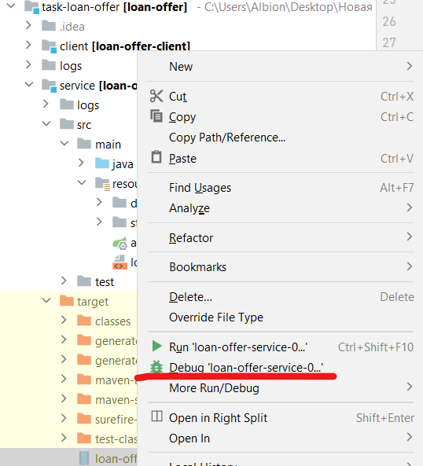

# loan-offer-service

## **Создать БД**

```
create database loan_offer;
```

## **Создать схему в БД loan_offer**

```
   create schema data;
```

## **Настроить файл пропертей**

**application.yml** предоставляется вместе с jar файлом.
Для работы сервиса необходимо настроит:

1. Доступ к PostgreSQL.


## **Собрать проект с помощью Maven**

## **Запустить сервис**

Можно запустить в intellij IDEA



# ИЛИ

Версия java

```
% java -version                                                                                          
openjdk version "20.0.1" 2023-04-18
OpenJDK Runtime Environment (build 20.0.1+10)
OpenJDK 64-Bit Server VM (build 20.0.1+10, mixed mode, sharing)
```

При запуске нужно указать расположение **application.yml**.

Пример запуска:

```
java -jar loan-offer-service-0.0.1-SNAPSHOT.jar --spring.config.location=/service/src/main/resources/application.yml 
```

## **Открыть приложение в браузере**
   Перейти по ссылке в браузере:

```
   localhost:8080/index.html
```